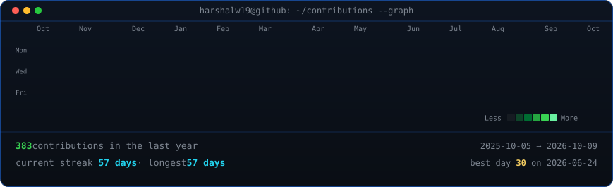

<picture>
    <source media="(prefers-color-scheme: light)" srcset="https://www.gitskins.com/api/section/hero?username=harshalw19&theme=aurora&avatar=https%3A%2F%2Favatars.githubusercontent.com%2Fu%2F126320779%3Fu%3Ddca3c0753011f722c74511acb91ff5742c52db92%26v%3D4&mode=light" />
    
  </picture>

<h1>Harshal Warukar</h1>

<strong>Devops and Cloud Engineer</strong>

<!-- 
Devops Engineer and Full Stack Developer
 -->

<table width="100%" align="center">
<tr>
<!-- <td width="25%" align="center"><strong>1</strong> Followers</td> -->
<td width="25%" align="center"><strong>18</strong> Repositories</td>
<!-- <td width="25%" align="center"><strong>1</strong> Stars</td> -->
<td width="25%" align="center"><strong>376</strong> Contributions</td>
</tr>
</table>

<<<<<<< HEAD
 
 

<h3><code>harshalw19@github ~ $ ./contributions.sh</code></h3>

 
 

<h3><code>harshalw19@github ~ $ ./links.sh</code></h3>

<b>Cloud and Devops Engineer</b>

[-harshalwarukar-000000?style=for-the-badge&logo=X&logoColor=white)](https://twitter.com/harshalw2003)

 

=======

<a href="https://github.com/harshalw19">GitHub</a>

>>>>>>> aaf2311 (README.md updated)

<h2>Building in public</h2>

<table width="100%">
<tr>
<td width="62%" valign="top">

Devops and Cloud Engineer

<strong>Focus:</strong> Kubernetes · Terraform · AWS · Agentic AI 

Designed to make the work, momentum, and next conversation easy to find.

</td>
<td width="38%" valign="top">

</td>
</tr>
</table>

<h2>What I’m shipping</h2>

  

<h2>Featured work</h2>

<table width="100%">
<tr>
<td width="58%" valign="top">

</td>
<td width="42%" valign="top">
<h3><a href="https://github.com/harshalw19/bidauc-backend-mircoservices"><strong>BidAuc-Microservices</strong></a></h3>

A project built and shared in public.

Microservices · Kubernetes · EKS · IaC

<a href="https://github.com/harshalw19/bidauc-backend-mircoservices">View project →</a>

</td>
</tr>
</table>

<h2>Selected work</h2>

<table width="100%">
<tr>
<td width="33%" valign="top">
<h3><a href="https://github.com/harshalw19/bidauc-backend-mircoservices"><strong>BidAuc Microservices

A Blue-collar services Marketplace with multiple microservices.

Microservices · Kubernetes · EKS · IaC

</td>
<td width="33%" valign="top">
<h3><a href="https://github.com/harshalw19/Applied-AI"><strong>Applied-AI</strong></a></h3>

Building and Shipping Real AI Agents

Python · Langraph · Langchain /sub>

</td>
<td width="33%" valign="top">
<h3><a href="https://github.com/harshalw19/Java-dsa-vault"><strong>Java-dsa-vault</strong></a></h3>

DSA in JAVA

Java · Tree · Graphs

</td>

</tr>
</table>

<h2>Signal</h2>

  

<h2>Stack</h2>

  

<h2>Activity</h2>

  <picture>
    <source media="(prefers-color-scheme: light)" srcset="https://www.gitskins.com/api/section/heatmap?username=harshalw19&theme=aurora&avatar=https%3A%2F%2Favatars.githubusercontent.com%2Fu%2F126320779%3Fu%3Ddca3c0753011f722c74511acb91ff5742c52db92%26v%3D4&mode=light" />
    
  </picture>

<table width="100%">
<tr>
<td width="62%" valign="middle"><h2>Let’s build something</h2>
Open to thoughtful collaboration, ambitious products, and useful open-source work.
</td>
<td width="38%" valign="middle" align="right"><a href="https://github.com/harshalw19">GitHub</a></td>
</tr>
</table>

Harshal Warukar · live profile data, designed with <a href="https://www.gitskins.com/readme-generator">GitSkins</a>

